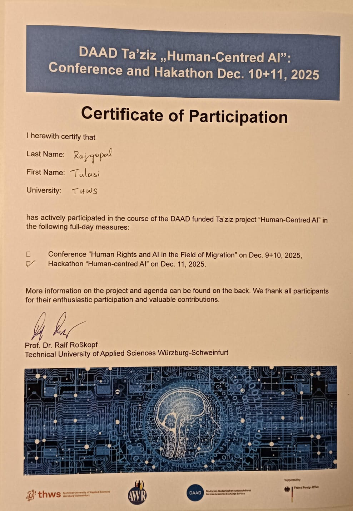

# DAAD Ta'ziz "Human-Centred AI" Event

## 📜 Certificate of Participation

## 🎯 Event Details

| Detail | Information |
|--------|-------------|
| **Event** | DAAD Ta'ziz "Human-Centred AI" Conference and Hackathon |
| **Date** | December 10-11, 2025 |
| **Location** | THWS (Technical University of Applied Sciences Würzburg-Schweinfurt) |
| **Organized by** | Prof. Dr. Ralf Roßkopf |

## 📋 Activities

- ✅ Hackathon "Human-centred AI" on Dec. 11, 2025

## 🏛️ About the Event

The DAAD funded Ta'ziz project "Human-Centred AI" included full-day measures focusing on the intersection of AI technology and human-centered design principles.

## 👥 Team Participation

Team members actively participated in this DAAD event as part of the NLP course activities.
